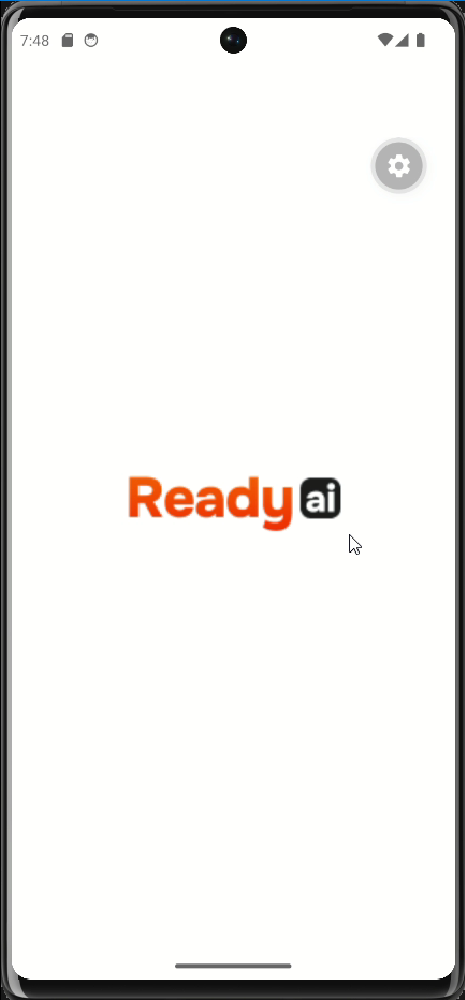
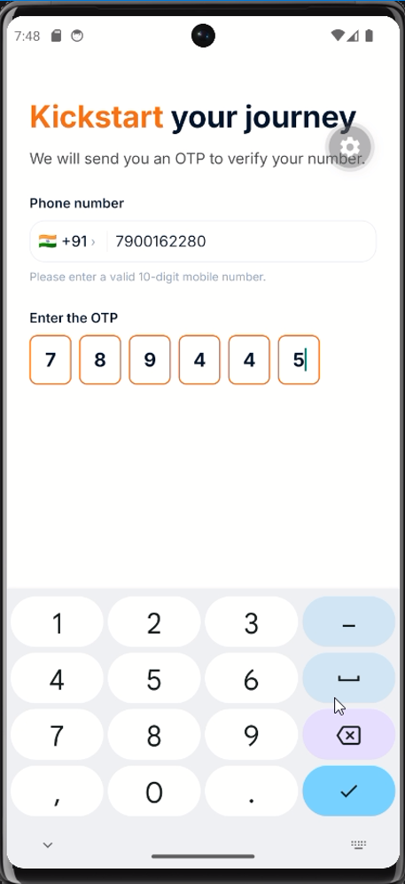
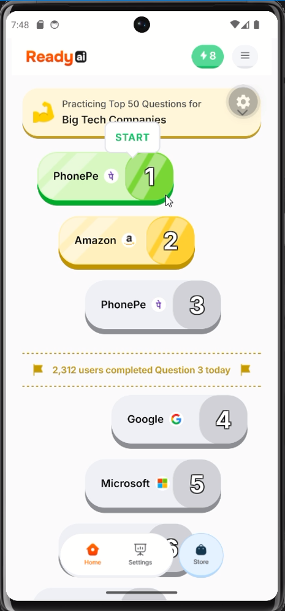
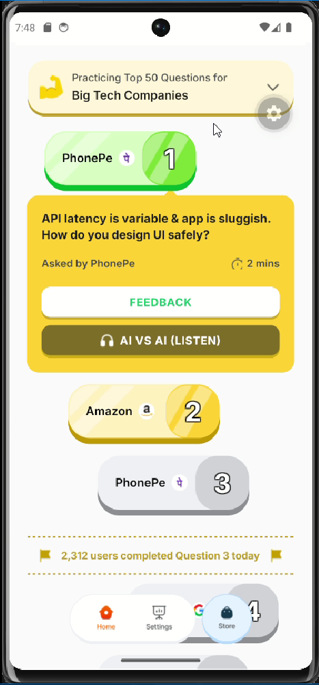
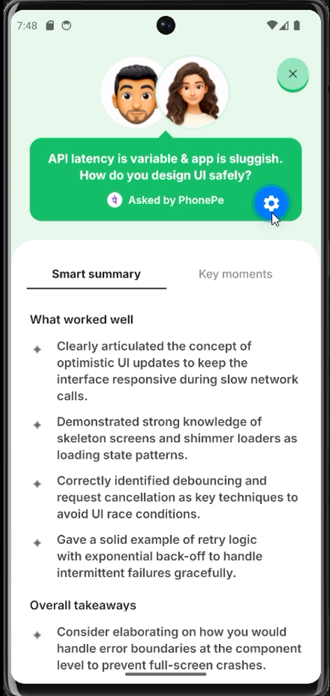
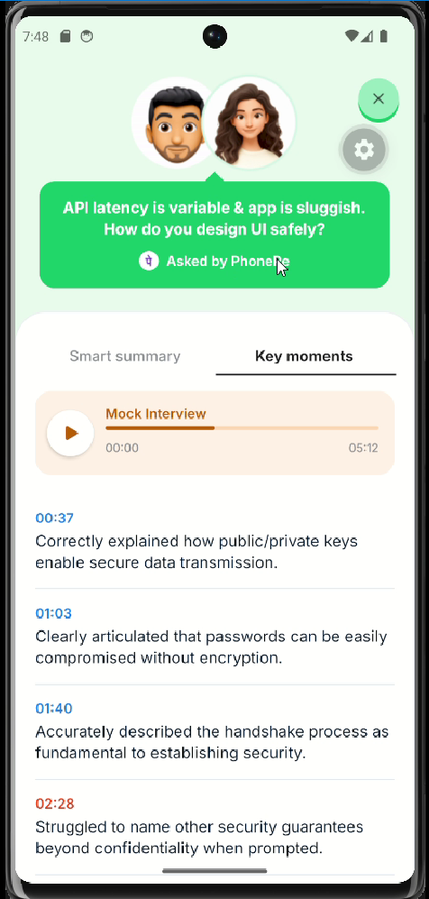
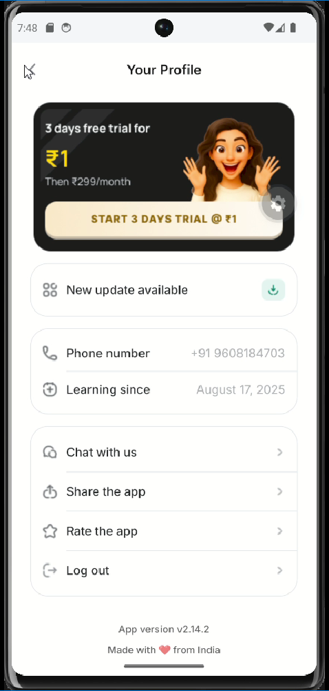

# Ready! — AI-Powered Interview Practice App

React Native Take-Home Assignment — Grapevine

A pixel-perfect implementation of the **Ready!** interview practice application, built in React Native (Expo) with TypeScript. The app guides users through AI-powered mock interviews, provides detailed session feedback, and tracks their progress.

---

## Demo & Download

The demo video and APK file are both available in the Google Drive folder below:

**Google Drive:** https://drive.google.com/drive/folders/18M3s_t2lSmO696IgB92znJ_3xiL-KFyT?usp=sharing

---

## UI Screenshots

| Splash | Welcome | Login |
|:---:|:---:|:---:|
|  |  |  |

| Home | Home (Open State) | Feedback |
|:---:|:---:|:---:|
|  |  |  |

| Highlights | Settings | |
|:---:|:---:|:---:|
|  |  | |

> Save your screenshots in the `/screenshots` folder at the project root using the filenames listed above.

---

## Screens Implemented

| # | Screen | Status |
|---|---|---|
| 1 | Splash Screen | Complete |
| 2 | Welcome Screen | Complete |
| 3 | Login (Phone + OTP) | Complete with animated OTP reveal |
| 4 | Home Screen | Complete with FlashList |
| 5 | Home — Open State (Question Detail) | Complete with inline expansion |
| 6 | Session Result — Smart Summary tab | Complete |
| 7 | Session Result — Key Moments tab | Complete |
| 8 | Settings Screen | Complete |
| 9 | Store Screen | Complete (branded placeholder) |

---

## Bonus Features Implemented

- Smooth screen transitions — `slide_from_right` and `fade` animations via React Navigation options
- Screen entry animations — `FadeIn` layout animations on Home, Welcome, Login, and Settings
- 3D press interactions — `react-native-reanimated` `withSpring` push-down effect on all primary buttons and the context card
- Haptic feedback — `expo-haptics` on question card press and primary button tap
- Animated OTP reveal — OTP input slides in with `FadeInDown` after a valid phone number is entered
- Animated tab indicator — Smooth sliding underline on the Session Result tabs
- `React.memo` on `QuestionCard`, `SmartSummaryTab`, `KeyMomentsTab`
- `useMemo` for derived list data in `HomeScreen`
- Accessibility labels on all interactive elements (`accessibilityLabel`, `accessibilityRole`)
- Social proof banner after Question 3

---

## Project Architecture

```
src/
├── components/
│   └── ui/
│       ├── app-text.tsx           # Typed Text wrapper with variant system
│       ├── animated-pressable.tsx # ScalePressable reusable component
│       └── safe-screen.tsx        # SafeAreaView wrapper
├── features/
│   ├── auth/
│   │   └── screens/
│   │       ├── splash-screen.tsx
│   │       ├── welcome-screen.tsx  # Also exports OrangePrimaryButton
│   │       └── login-screen.tsx
│   ├── home/
│   │   ├── components/
│   │   │   └── question-card.tsx   # Animated 3D card component
│   │   ├── screens/
│   │   │   └── home-screen.tsx     # FlashList + inline open state
│   │   └── types.ts
│   ├── session-result/
│   │   ├── components/
│   │   │   ├── smart-summary-tab.tsx
│   │   │   └── key-moments-tab.tsx
│   │   ├── screens/
│   │   │   └── session-result-screen.tsx
│   │   └── types.ts
│   ├── settings/
│   │   └── screens/
│   │       └── settings-screen.tsx
│   └── store/
│       └── screens/
│           └── store-screen.tsx
├── navigation/
│   ├── root-navigator.tsx
│   ├── auth-navigator.tsx
│   ├── main-navigator.tsx
│   └── types.ts                    # All navigation param lists
├── theme/
│   ├── colors.ts
│   ├── spacing.ts
│   ├── typography.ts
│   └── index.ts
└── mock-data/
    ├── companies.json
    ├── questions.json
    ├── session-result.json
    └── user.json
```

---

## Getting Started

### Prerequisites

- Node.js 18+
- Yarn (`npm install -g yarn`)
- Java 17+ (bundled with Android Studio JBR)
- Android Studio with at least one emulator configured, or a physical Android device with USB debugging enabled
- `ANDROID_HOME` environment variable set

### First-Time Setup

```bash
# 1. Install JS dependencies
yarn

# 2. Clean and generate the native android/ folder
yarn prebuild:clean

# 3. Build and run on Android
npm run android
```

> The first build takes a few minutes. Subsequent runs are significantly faster.

### Subsequent Runs

```bash
npm run android
```

If you change `app.json`, add a native library, or hit native build issues:

```bash
yarn prebuild:clean
npm run android
```

---

## Technical Stack

| Category | Technology |
|---|---|
| Framework | Expo (React Native) |
| Language | TypeScript (strict mode) |
| Navigation | React Navigation v7 (Native Stack + Bottom Tabs) |
| Animations | `react-native-reanimated` v3 |
| Lists | `@shopify/flash-list` |
| Images | `expo-image` with `cachePolicy="memory-disk"` |
| Fonts | Inter via `@expo-google-fonts/inter` |
| Haptics | `expo-haptics` |
| Bottom Sheet | `@gorhom/bottom-sheet` |

---

## Technical Requirements Checklist

- TypeScript strict mode — enabled, all props and data shapes typed
- Feature-based folder structure — `auth`, `home`, `session-result`, `settings`, `store`
- No hardcoded hex values in components — colors from `colors`, spacing from `spacing`, fonts from `typography`
- `expo-image` used for all images with `cachePolicy="memory-disk"`
- `@shopify/flash-list` used for the Home screen question list
- React Navigation v7 — Stack for auth flow, Bottom Tabs for main app
- Centralized navigation types in `navigation/types.ts`
- `@/` absolute imports throughout — no cross-feature relative imports
- kebab-case file naming with PascalCase exports

---

## Design Reference

**Figma:** https://www.figma.com/design/8i6wNZ6dafxTh5Zl9jbgu3/Grapevine-Internship-Program?node-id=2-16244&p=f&m=dev

---

## Notes

See [`NOTES.md`](./NOTES.md) for a full breakdown of trade-offs, design decisions, and Figma assumptions made during development.
